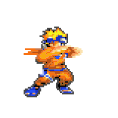
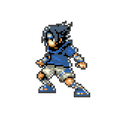

# draggabilly

Ce projet est basé sur Draggabilly pour [créer un concept sur le principe du drag and drop].

Figma : https://www.figma.com/design/mW5TwXslj5baeL65JYN80z/Draggabilly?node-id=0-1&t=rML61ngPFuZXI3Vy-1

## Démo

[Visitez le site déployé](https://shalshouli.github.io/draggabilly2//)

**Images** 

- **index.html** : Page principale
- **style.css** : Styles du site

## Prérequis

- [Draggabilly](https://draggabilly.desandro.com//)

## Fonctionnalités

- Fonctionnalité 1
- Fonctionnalité 2
- Fonctionnalité 3
