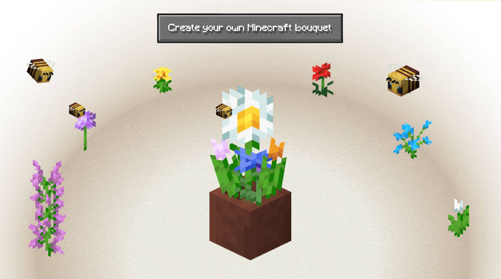
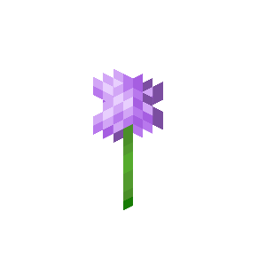
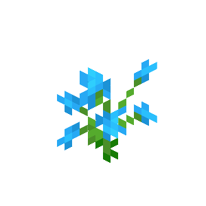
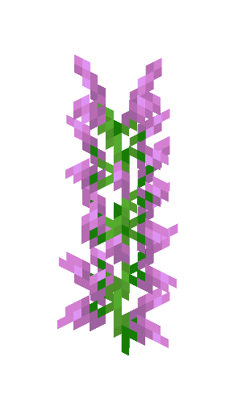
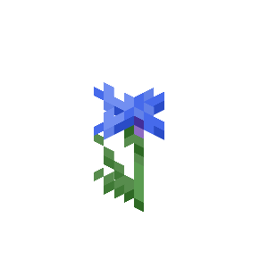

# draggabilly

Ce projet est basé sur Draggabilly pour créer un concept sur le principe du drag and drop.
J'ai décidé de créer une surface permettant de concevoir son propre bouquet avec les fleurs disponibles dans le jeu Minecraft.

Figma : https://www.figma.com/design/mW5TwXslj5baeL65JYN80z/Draggabilly?node-id=0-1&t=rML61ngPFuZXI3Vy-1

## Démo

[Visitez le site déployé](https://shalshouli.github.io/draggabilly2//)

**Images** 

- **index.html** : Page principale
- **style.css** : Styles du site

## Prérequis

- [Draggabilly](https://draggabilly.desandro.com//)

## Assets

- Toutes les fleurs provenant de Minecraft
- Le vase de Minecraft
- Les abeilles Minecraft
- Un fond sobre 
- Police et bouton de Minecraft